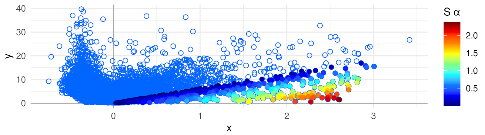

<!-- badges: start -->
[](https://bioconductor.org/checkResults/release/bioc-LATEST/APL)
[](https://bioconductor.org/checkResults/devel/bioc-LATEST/APL)
[](http://bioconductor.org/packages/stats/bioc/APL/)
[](https://support.bioconductor.org/tag/APL)
[](https://bioconductor.org/packages/release/bioc/html/APL.html#since)
[](http://bioconductor.org/checkResults/devel/bioc-LATEST/APL/)
[](https://bioconductor.org/packages/release/bioc/html/APL.html#since)
<!-- badges: end -->



# APL

`APL` is a package developed for computation of Association Plots, a method for visualization and analysis of single cell transcriptomics data. The main focus of `APL` is the identification of genes characteristic for individual clusters of cells from input data. 

When working with `APL` package please cite:
```
Gralinska, E., Kohl, C., Fadakar, B. S., & Vingron, M. (2022). 
Visualizing Cluster-specific Genes from Single-cell Transcriptomics Data Using Association Plots. 
Journal of Molecular Biology, 434(11), 167525.
```

## Installation

The newest version of`APL` can be installed from GitHub:
    
    library(devtools)
    install_github("VingronLab/APL")
    

To additionally build the package vignette, run instead:

    install_github("VingronLab/APL", build_vignettes = TRUE, dependencies = TRUE)


Building the vignette will however take considerable time.

**The vignette can also be found under the link: https://vingronlab.github.io/APL/ (hyperlink in the GitHub repository description).**

To install the `APL` from Bioconductor, run:

    if (!requireNamespace("BiocManager", quietly = TRUE))
        install.packages("BiocManager")
    
    BiocManager::install("APL")


## Feature overview

Please run 
    
    vignette("APL")

after installation with `build_vignettes = TRUE` for an introduction into the package.
